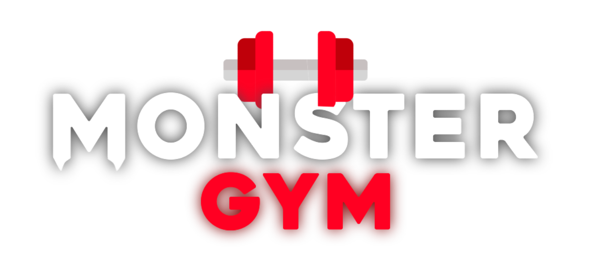

<div align="center">
  
</div>

---

<h1 align="center">🏋🏻Monster Gym</h1>
<h3 align="center">✔ STATUS: Concluído ✔</h3>

---

<h2 align="center">📖Sobre</h2>

<p align="center">Este projeto foi realizado para simular um web site de uma academia, ele consiste em uma pagina principal mostrando resumidamente as modalidades disponíveis,
os benefícios e diferencias de se escolher essa academia, cards com os planos e seus benefícios, avaliações dos usuários e a localização usando o google maps.
Uma pagina mostrando todas as unidades detalhadamente, como uma barra de pesquisa de unidades por cidade e um filtro por estado.
Uma pagina mostrando detalhadamente todas as modalidades. Uma página com os planos mais detalhados. E por fim uma pagina de login e cadastro. Ele é 100% responsivo.</p>

---

<h2 align="center">✔O site contém:</h2>

✅ Material UI<br>
✅ Animações<br>
✅ Slider<br>
✅ Campo de busca<br>
✅ Filtro<br>
✅ Navbar<br>
✅ Formulário<br>
✅ Responsividade<br>
### etc...
---

<h2>Instalando</h2>

```
npm install
```
ou
```
npm i
```

<h2>E logo em seguida:</h2>

```
npm start
```

<p>O projeto vai ser iniciado em <a target="_blank" href='http://localhost:3000'>http://localhost:3000</p>

<h2 align="center">🖥Preview</h2>

</img>
<br>
<br>
<br>
</img>

### Veja o projeto em funcionamento <a target="_blank" href="https://monstergym.netlify.app/">aqui</a>. 🧐

---

<h2 align="center">🛠 Tecnologias</h2>

- [React](https://pt-br.reactjs.org/)
- [Material UI](https://mui.com/pt/)
- [HTML](https://html.com/)
- [CSS](https://developer.mozilla.org/pt-BR/docs/Web/CSS)
- [JavaScript](https://www.javascript.com/)

---

<h2 align="center">📝Licença</h2>

<p align="center">
   Este repositório está sob licença MIT. Você pode ver o arquivo <a href="https://github.com/gabriell-c/Monster-gym/blob/main/License"> LICENSE</a>
   para mais detalhes. 😉
</p>
